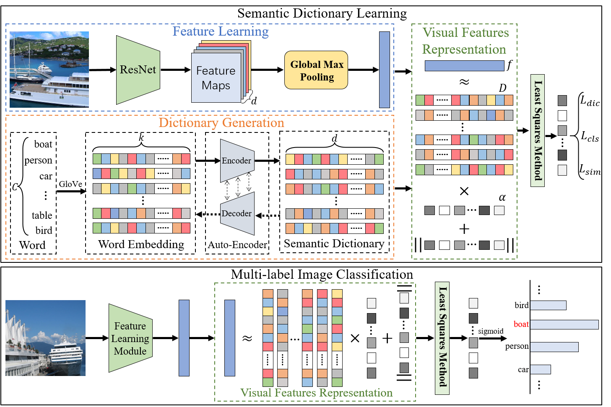

# Deep Semantic Dictionary Learning for Multi-label Image Classification

Implementation of the paper: "[Deep Semantic Dictionary Learning for Multi-label Image Classification](https://arxiv.org/abs/1908.07325)" (AAAI 2021) by Fengtao Zhou, Sheng Huang, Yun Xing.

**Abstract:**  
Compared with single-label image classification, multi-label image classification is more practical and challenging. Some recent studies attempted to leverage the semantic information of categories for improving multi-label image classification performance. However, these semantic-based methods only take semantic information as type of complements for visual representation without further exploitation. In this paper, we present a innovative path towards the solution of the multi-label image classification which considers it as a dictionary learning task. A novel end-to-end model named Deep Semantic Dictionary Learning (DSDL) is designed. In DSDL, an auto-encoder is applied to generate the semantic dictionary from class-level semantics and then such dictionary is utilized for representing the visual features extracted by Convolutional Neural Network (CNN) with label embeddings. The DSDL provides a simple but elegant way to exploit and reconcile the label, semantic and visual spaces simultaneously via conducting the dictionary learning among them. Moreover, inspired by iterative optimization of traditional dictionary learning, we further devise a novel training strategy named Alternately Parameters Update Strategy (APUS) for optimizing DSDL, which alteratively optimizes the representation coefficients and the semantic dictionary in forward and backward propagation. Extensive experimental results on three popular benchmarks demonstrate that our method achieves promising performances in comparison with the state-of-the-arts.



## Environment

Python3.5.2

Pytorch 1.1.0

torchvision 0.2.2

## Datasets
#### [Microsoft COCO](http://cocodataset.org/#home)
Microsoft COCO is large scale images with Common Objects in Context (COCO), which is one of the most popular image 
datasets out there, with applications like object detection, segmentation, and image caption. The images in the dataset 
are everyday objects captured from everyday scenes. COCO provides multi-object labeling, segmentation mask annotations, 
image captioning, key-point detection and panoptic segmentation annotations with a total of 81 categories, making it a very 
versatile and multi-purpose dataset. More concretely, the dataset contains 122,218 images and covers 80 common 
categories (class 81 is background). For multi-label image classification, MS COCO is further divided into a training set of 82,081 images and a validation set 
of 40,137 images. Since the ground truth annotations of test set are unavailable, we usually train our model on the training 
datasets and evaluate on the validation set. <br />
You can see more detailed description of this dataset on its [website](https://cocodataset.org/). <br />

#### [Pascal VOC 2007](http://host.robots.ox.ac.uk/pascal/VOC/voc2007/)
Pascal VOC 2007 dataset is a benchmark in the field of computer vision, which is widely used in image classification,
object detection, target segmentation and other tasks, which contains four categories: Vehicle, Indoor, Animal,
Person, and can be subdivided into **20 classes**.

* Person: person
* Animal: bird, cat, cow, dog, horse, sheep
* Vehicle: aeroplane, bicycle, boat, bus, car, motorbike, train
* Indoor: bottle, chair, dining table, potted plant, sofa, tv/monitor

For multi-label image classification, VOC 2007 dataset is divided into
**training (2,501)**, **validation (2,510)** and **testing (4,952)** sets. Following the previous work, we usually use the train and
validate set to train our model, and evaluate the classification performance on the test set.<br />
You can see more detailed description of this dataset on its [website](http://host.robots.ox.ac.uk/pascal/VOC/voc2007/). <br />

#### [Pascal VOC 2012](http://host.robots.ox.ac.uk/pascal/VOC/voc2012/) - 20 common object categories
The classes of VOC 2012 are same as VOC 2007, but the 2012 dataset contains images from 2008-2011 and there is no 
 intersection with 2007. VOC 2012 dataset is divided into **training (5,717)**, **validating (5,823)** and **testing (10,991)** set. 
 However, no ground truth labels are provided in the test set. Therefore, all the approaches have to be evaluated by 
 submitting the testing results to the PASCAL VOC Evaluation Server. We usually train our model on training set, and 
 fine-tune on validate set. Then, the result of testing set is submitted to 
 **[Evaluation Server](http://host.robots.ox.ac.uk:8080/)** for evaluation.<br />
You can see more detailed description of this dataset on its **[website](http://host.robots.ox.ac.uk/pascal/VOC/voc2012/)**. <br />


## Download pretrain models

coco/checkpoint/coco ([GoogleDrive](https://drive.google.com/file/d/1gEGHRAP8T5qHL3KE433F_FmyBkBTz1Ti/view?usp=sharing))

voc2007/checkpoint/voc2007 ([GoogleDrive](https://drive.google.com/file/d/1vS-EponLVU1MDwTfP3XUVWO70M7R1Yv4/view?usp=sharing))

voc2012/checkpoint/voc2012 ([GoogleDrive](https://drive.google.com/file/d/1BHPWXp6axbRRGl44ju75eb3ghftX8Ikk/view?usp=sharing))

### Demo VOC 2007

```sh
cd voc2007
bash run_voc2007
```

### Demo VOC 2012

```sh
cd voc2012
bash run_voc2012
```

### Demo MS-COCO

```sh
cd coco
bash run_coco
```

## Experimental Results
### The performance comparison on the MS-COCO
|  Method      |mAP  |CP-3 |CR-3 |CF1-3|OP-3 |OR-3 |OF1-3|CP   |CR   |CF1  |OP   |OR   |OF1  |
|:------------:|:---:|:---:|:---:|:---:|:---:|:---:|:---:|:---:|:---:|:---:|:---:|:---:|:---:|
|WARP          |-    |59.3 |52.5 |55.7 |59.8 |61.4 | 60.7|-    | -   |-    | -   | -   | -   |
|CNN-RNN       |61.2 |66.0 |55.6 |60.4 |69.2 |66.4 | 67.8|-    | -   |-    | -   | -   | -   |
|ResNet-101    |77.3 |84.1 |59.4 |69.7 |89.1 |62.8 | 73.6|80.2 | 66.7|72.8 | 83.9| 70.8| 76.8|
|RDAR          |73.4 |79.1 |58.7 |67.4 |84.0 |63.0 | 72.0|-    | -   |-    | -   | -   | -   |
|ResNet-SRN    |77.1 |85.2 |58.8 |67.4 |87.4 |62.5 | 72.9|81.6 | 65.4|71.2 | 82.7| 69.9| 75.8|
|RLSD          |68.2 |67.6 |57.2 |62.0 |70.1 |63.4 | 66.5|-    | -   |-    | -   | -   | -   |
|KD-WSD        |74.6 |-    |-    |66.8 |-    |-    | 72.7|-    | -   |69.2 | -   | -   | 74.0|
|RARL          |-    |78.8 |57.2 |66.2 |84.0 |61.6 | 71.1|-    | -   |-    | -   | -   | -   |
|DELTA         |71.3 |-    |-    |-    |-    |-    | -   |-    | -   |-    | -   | -   | -   |
|ResNet101-ACfs|77.5 |85.2 |59.4 |68.0 |86.6 |63.3 | 73.1|77.4 | 68.3|72.2 | 79.8| 73.1| 76.3|
|CoP           |81.1 |86.4 |62.9 |72.7 |88.7 |65.1 | 75.1|81.2 | 70.8|75.8 | 83.6| 73.3| 78.1|
|DSDL          |81.7 |88.1 |62.9 |73.4 |89.6 |65.3 | 75.6|84.1 | 70.4|76.7 | 85.1| 73.9| 79.1|     

### The performance comparison on the VOC 2007
|    Method    | aero  |  bike |  bird |  boat | bottle|  bus  |  car  |  cat  | chair |  cow  | table |  dog  | horse | motor | person| plant | sheep |  sofa | train |   tv  | mAP |
|:------------:|:-----:|:-----:|:-----:|:-----:|:-----:|:-----:|:-----:|:-----:|:-----:|:-----:|:-----:|:-----:|:-----:|:-----:|:-----:|:-----:|:-----:|:-----:|:-----:|:-----:|:---:|
|HCP           | 98.6  |	97.1  |	98.0  |	95.6  |	75.3  |	94.7  |	95.8  |	97.3  |	73.1  |	90.2  |	80.0  |	97.3  |	96.1  |	94.9  |	96.3  |	78.3  |	94.7  |	76.2  |	97.9  |	91.5  |	90.9|
|CNN-RNN       | 96.7  |	83.1  |	94.2  |	92.8  |	61.2  |	82.1  |	89.1  |	94.2  |	64.2  |	83.6  |	70.0  |	92.4  |	91.7  |	84.2  |	93.7  |	59.8  |	93.2  |	75.3  |	99.7  |	78.6  |	84.0|
|ResNet-101    | 99.5  |	97.7  |	97.8  |	96.4  |	65.7  |	91.8  |	96.1  |	97.6  |	74.2  |	80.9  |	85.0  |	98.4  |	96.5  |	95.9  |	98.4  |	70.1  |	88.3  |	80.2  |	98.9  |	89.2  |	89.9|
|FeV+LV        | 97.9  |	97.0  |	96.6  |	94.6  |	73.6  |	93.9  |	96.5  |	95.5  |	73.7  |	90.3  |	82.8  |	95.4  |	97.7  |	95.9  |	98.6  |	77.6  |	88.7  |	78.0  |	98.3  |	89.0  |	90.6|
|RCP           | 99.3  |	97.6  |	98.0  |	96.4  |	79.3  |	93.8  |	96.6  |	97.1  |	78.0  |	88.7  |	87.1  |	97.1  |	96.3  |	95.4  |	99.1  |	82.1  |	93.6  |	82.2  |	98.4  |	92.8  |	92.5|
|RDAR          | 98.6  |	97.4  |	96.3  |	96.2  |	75.2  |	92.4  |	96.5  |	97.1  |	76.5  |	92.0  |	87.7  |	96.8  |	97.5  |	93.8  |	98.5  |	81.6  |	93.7  |	82.8  |	98.6  |	89.3  |	91.9|
|RMIC          | 97.1  |	91.3  |	94.2  |	57.1  |	86.7  |	90.7  |	93.1  |	63.3  |	83.3  |	76.4  |	92.8  |	94.4  |	91.6  |	95.1  |	92.3  |	59.7  |	86.0  |	69.5  |	96.4  |	79.0  |	84.5|
|RLSD          | 96.4  |	92.7  |	93.8  |	94.1  |	71.2  |	92.5  |	94.2  |	95.7  |	74.3  |	90.0  |	74.2  |	95.4  |	96.2  |	92.1  |	97.9  |	66.9  |	93.5  |	73.7  |	97.5  |	87.6  |	88.5|
|RARL          | 98.6  |	97.1  |	97.1  |	95.5  |	75.6  |	92.8  |	96.8  |	97.3  |	78.3  |	92.2  |	87.6  |	96.9  |	96.5  |	93.6  |	98.5  |	81.6  |	93.1  |	83.2  |	98.5  |	89.3  |	92.0|
|ML-GCN        | 99.5  |	98.5  |	98.6  |	98.1  |	80.8  |	94.6  |	97.2  |	98.2  |	82.3  |	95.7  |	86.4  |	98.2  |	98.4  |	96.7  |	99.0  |	84.7  |	96.7  |	84.3  |	98.9  |	93.7  |	94.0|
|CoP           | 99.9  |	98.4  |	97.8  |	98.8  |	81.2  |	93.7  |	97.1  |	98.4  |	82.7  |	94.6  |	87.1  |	98.1  |	97.6  |	96.2  |	98.8  |	83.2  |	96.2  |	84.7  |	99.1  |	93.5  |	93.8|
|DSDL          | 99.8  |	98.7  |	98.4  |	97.9  |	81.9  |	95.4  |	97.6  |	98.3  |	83.3  |	95.0  |	88.6  |	98.0  |	97.9  |	95.8  |	99.0  |	86.6  |	95.9  |	86.4  |	98.6  |	94.4  |	94.4|


### The performance comparison on the VOC 2012
|    Method    | aero  |  bike |  bird |  boat | bottle|  bus  |  car  |  cat  | chair |  cow  | table |  dog  | horse | motor | person| plant | sheep |  sofa | train |   tv  | mAP |
|:------------:|:-----:|:-----:|:-----:|:-----:|:-----:|:-----:|:-----:|:-----:|:-----:|:-----:|:-----:|:-----:|:-----:|:-----:|:-----:|:-----:|:-----:|:-----:|:-----:|:-----:|:---:|
|VGG19+SVM     | 99.1  | 88.7  | 95.7  | 93.9  | 73.1  | 92.1  | 84.8  | 97.7  | 79.1  | 90.7  | 83.2  | 97.3  | 96.2  | 94.3  | 96.9  | 63.4  | 93.2  | 74.6  | 97.3  | 87.9  | 89.0|
|HCP           | 99.1  | 92.8  | 97.4  | 94.4  | 79.9  | 93.6  | 89.8  | 98.2  | 78.2  | 94.9  | 79.8  | 97.8  | 97.0  | 93.8  | 96.4  | 74.3  | 94.7  | 71.9  | 96.7  | 88.6  | 90.5|
|FeV+LV        | 98.4  | 92.8  | 93.4  | 90.7  | 74.9  | 93.2  | 90.2  | 96.1  | 78.2  | 89.8  | 80.6  | 95.7  | 96.1  | 95.3  | 97.5  | 73.1  | 91.2  | 75.4  | 97.0  | 88.2  | 89.4|
|RCP           | 99.3  | 92.2  | 97.5  | 94.9  | 82.3  | 94.1  | 92.4  | 98.5  | 83.8  | 93.5  | 83.1  | 98.1  | 97.3  | 96.0  | 98.8  | 77.7  | 95.1  | 79.4  | 97.7  | 92.4  | 92.2|
|RMIC          | 98.0  | 85.5  | 92.6  | 88.7  | 64.0  | 86.8  | 82.0  | 94.9  | 72.7  | 83.1  | 73.4  | 95.2  | 91.7  | 90.8  | 95.5  | 58.3  | 87.6  | 70.6  | 93.8  | 83.0  | 84.4|
|RLSD          | 96.4  | 92.7  | 93.8  | 94.1  | 71.2  | 92.5  | 94.2  | 95.7  | 74.3  | 90.0  | 74.2  | 95.4  | 96.2  | 92.1  | 97.9  | 66.9  | 93.5  | 73.7  | 97.5  | 87.6  | 88.5|
|DELTA         |   -   |   -   |   -   |   -   |   -   |   -   |   -   |   -   |   -   |   -   |   -   |   -   |   -   |   -   |   -   |   -   |   -   |   -   |   -   |   -   | 90.3|
|DSDL          | 99.4  | 95.3  | 97.6  | 95.7  | 83.5  | 94.8  | 93.9  | 98.5  | 85.7  | 94.5  | 83.8  | 98.4  | 97.7  | 95.9  | 98.5  | 80.6  | 95.7  | 82.3  | 98.2  | 93.2  | 93.2|


## Tips
For any questions, please contact us (zft@cqu.edu.cn).